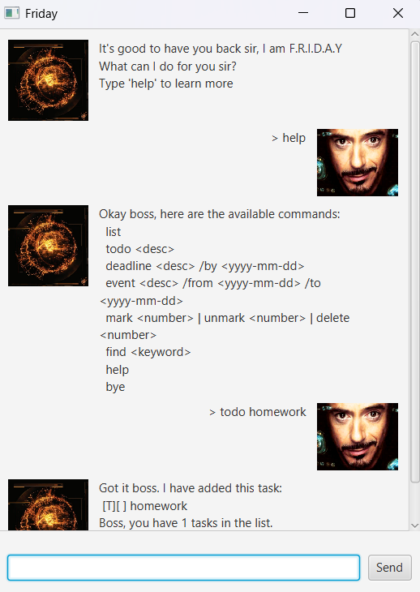

# Friday User Guide

Friday is your personal chatbot assistant that helps you manage tasks from the Command Line (CLI) and Graphical User Interface (GUI).

---

## Quick Start
1. Ensure you have Java 17 installed.
2. Download the latest `friday.jar` from [Releases](link-to-your-jar).
3. Run: `java -jar friday.jar`.

---

## Features

### Add a Todo
`todo <description>`  
Example: `todo read book`

### Add a Deadline
`deadline <description> /by <date>`  
Example: `deadline submit report /by 2025-10-01`

### Add an Event
`event <description> /from <start> /to <end>`  
Example: `event meeting /from 2025-10-01 /to 2025-10-02`

### List Tasks
`list`

### Mark/Unmark Tasks
`mark <number>`  
`unmark <number>`

### Delete Task
`delete <number>`

### Find Tasks
`find <keyword>`

### Help
`help`

### Exit
`bye`

---

## GUI Screenshot

---

## FAQ
**Q: What if I type the wrong command?**  
A: Friday will let you know with a friendly error message.

**Q: How can I find out the list of commands possible?**  
A: Use 'help' to find out all possible commands.
